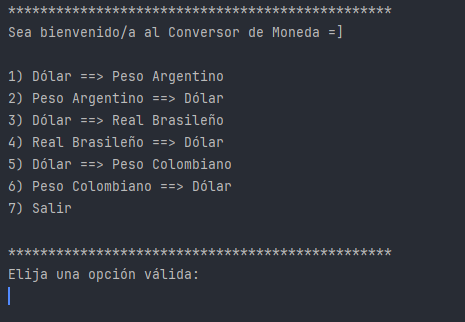
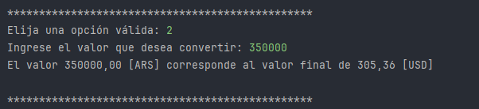

# 💱 Conversor de Conversion - Java

Aplicación de consola desarrollada en Java que permite convertir entre diferentes monedas utilizando la API de ExchangeRate.

---

## 🎯 Funcionalidades del sistema

- Interfaz de consola clara y fácil de usar.
- Menú interactivo para seleccionar conversiones.
- Permite convertir entre:
  - Dólar ⇨ Peso Argentino
  - Peso Argentino ⇨ Dólar
  - Dólar ⇨ Real Brasileño
  - Real Brasileño ⇨ Dólar
  - Dólar ⇨ Peso Colombiano
  - Peso Colombiano ⇨ Dólar
- Repite el menú hasta que el usuario elige salir.
- Obtiene el tipo de cambio actual usando la ExchangeRate API.
- Utiliza `HttpClient` para la conexión HTTP y `Gson` para parsear el JSON.

---

## 🧪 Capturas de pantalla

### Menú principal



### Conversión exitosa



---

## 🛠️ Tecnologías usadas

- Java 21
- IntelliJ IDEA
- API: [ExchangeRate API](https://www.exchangerate-api.com/)
- Gson para parseo de JSON
- `java.net.http.HttpClient` para solicitudes HTTP
- Git y GitHub

---

## 🧾 Estructura del proyecto


```
currency-converter/
│
├── src/
│ ├── ConversorApp.java
│ ├── CurrencyApi.java
│ └── Conversion.java
│
├── capturas/
│ ├── menu.png
│ └── conversion.png
│
├── README.md
└── .gitignore
```

---

## 👤 Autor

- Nombre: **Darío Vizcarra**
- Estudiante de **ONE | TECH FOUNDATION - Especialización Back-End**
- GitHub: [@DargorVZ](https://github.com/DargorVZ)

---

## 📌 Notas

- Requiere conexión a internet para acceder a los tipos de cambio actualizados.
- Si usás una API Key personalizada, recordá mantenerla privada.

---

